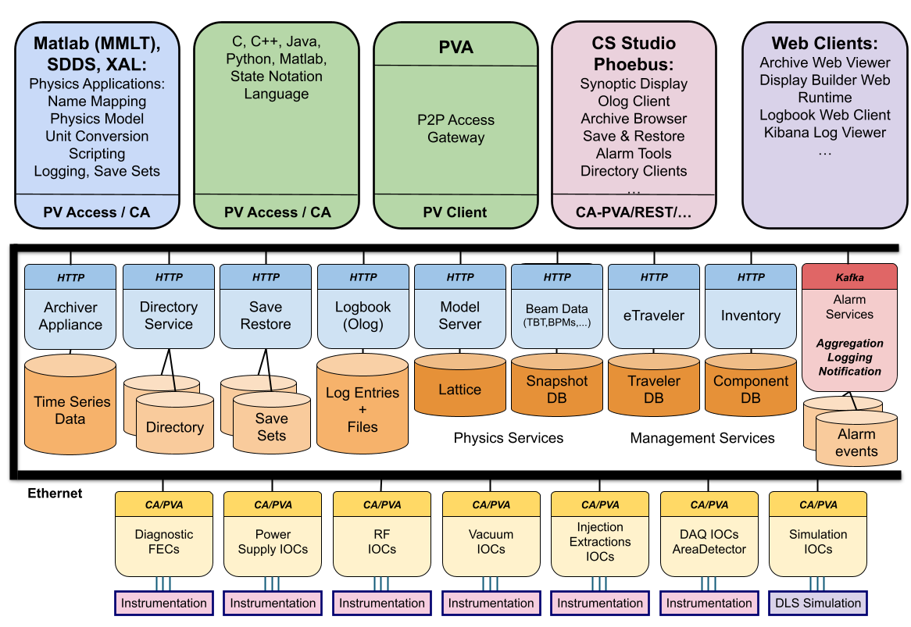

## Slide 1: Controls System Architecture

Charge questions addressed: CQ7 (design maturity readiness framing)

Slide overview:
Establish the review context, scope intent, and expected outcome of the presentation for the committee.

Slide 1:
- **Title: Controls System Architecture**
- **Subtitle: EIC Controls PDR Architecture Review**
- **Presenter block: team, date, review body**
- **Purpose statement:**
	**Present the baseline controls architecture, legacy coexistence strategy, and delivery model readiness for final design progression.**

Notes:
1. This talk addresses architecture maturity for the current review phase, not full final-design closure.
2. The core narrative is EPICS/PVA baseline, ADO coexistence strategy, and integrated operator and middle-layer tooling.
3. The presentation includes technical rationale, requirements alignment highlights, and implementation-readiness signals.

Detailed references appear in the technical slides where they are used.

## Slide 2: Charge Questions

Charge questions addressed: CQ1-CQ7 (definition and scope of all charge questions)

Slide overview:
Frame the review criteria and clarify which questions are addressed in this presentation phase versus later phases.

Slide 2:
- **CQ1: Are the system requirements sufficiently defined, understood, and documented for this phase of the design?**
- **CQ2: Do the designs meet the requirements?**
- **CQ3: Are the interfaces sufficiently defined, understood and documented for this phase of the design?**
- **CQ4: Are the design analysis, simulations, drawings and specifications, and work plans, sufficient for this phase of the design?**
- **CQ5: Have technical risks been identified and are mitigation plans adequate for this phase of the design?**
- **CQ6: Are plans to address ES&H and Quality sufficient for this phase of the design?**
- **CQ7: Is the overall design maturity sufficient to proceed with the final design phase?**

## Slide 3: Outline of the Talk

Charge questions addressed: CQ7 (overall maturity roadmap)

Slide overview:

Slide 3:
- **Scope**
- **high-level architecture**
- **EPICS**
- **ADO, dual-system coexistence, tradeoffs, and decision matrix**
- **Network architecture, subnet strategy, and buildout plan**
- **EPICS IOC continuity and pvAccess protocol value**
- **Middle-layer services, Phoebus toolkit, architecture, and web access**
- **CI/CD governance, automation stack, QA/QC gates, and domain pipelines**

Notes:
1. The outline is intentionally sequenced from strategic framing to technical architecture, then execution readiness.

## Slide 4: Scope

Charge questions addressed: CQ1, CQ3, CQ4, CQ7

Slide overview:
What this presentation covers at the architecture level.

Slide 4:
- **Controls system architecture baseline (EPICS 7, PVA-first)**
- **Coexistence strategy for EPICS and legacy ADO systems**
- **Middle-layer services and operator tools**
- **Network and infrastructure architecture**
- **CI/CD and governance model**

## Slide 5: High-Level EIC Controls Architecture

Charge questions addressed: CQ1, CQ3, CQ7

Slide overview:
Present a single high-level diagram of the EIC controls system architecture and explain the major layers.

Slide 5:

- **Diagram title: EIC Controls System Architecture (High-Level)**
- **Diagram layers:**
	- **Operator and application layer (Phoebus tools, web tools, HLAs)**
	- **Middle-layer services (Archiver, Alarm, Olog, ChannelFinder, Save/Restore, Gateway)**
	- **Control system layer (EPICS 7 with PVA-first, CA compatibility)**
	- **Legacy integration layer (AdoPvaSrv, AdoEpicsBridge)**
	- **Infrastructure layer (network zones, compute, storage, CI/CD platform)**
- **Interface emphasis:**
	- **User-facing workflows are uniform across EPICS-native and ADO-backed systems**
	- **Service APIs and protocol boundaries are explicit**

Notes:
1. This is the anchor diagram for the rest of the talk; later slides zoom into each layer.
2. The key message is architectural coherence: multiple subsystems, one operational experience.
3. Coexistence is intentional in this phase, with transition path toward EPICS-first operations.

References:
- Thin talk ecosystem visual source: [presentations/examples/thin_MOCR002_talk.pptx](examples/thin_MOCR002_talk.pptx)
- Ecosystem text basis: [rod/raw_resources/_extracted/MOCR002.txt](../rod/raw_resources/_extracted/MOCR002.txt)

## Slide 6: How EPICS Supports Our Requirements

Charge questions addressed: CQ1, CQ2, CQ7

Slide overview:
How EPICS maps to the functional and performance requirements, including high-scale operation.

Slide 6:
- **Functional support:**
	- **Distributed control model supports heterogeneous subsystems and interfaces**
	- **PVA-first data model supports structured data exchange and service integration**
	- **CA compatibility preserves legacy interoperability during transition**
- **Global collaboration support:**
	- **EPICS maintains a large, global device-support ecosystem across Base, IOC modules, and extensions**
	- **Hardware and soft-support module catalogs are community-maintained and continuously expanded**
	- **Expertise is distributed across major labs and facilities, reducing single-site dependency risk**
- **Performance and scale support:**
	- **EPICS IOC record processing supports standard periodic scan classes (10, 5, 2, 1, 0.5, 0.2, 0.1 seconds), i.e., up to 10 Hz in default periodic mode**
	- **Faster update behavior can be configured with non-standard scan rates or `I/O Intr` event-driven processing when device support and platform timing allow**
	- **EIC performance targets are explicit in the requirements: alarm threshold evaluation at >=10 Hz per monitored signal (`P-EIC-CTRL-SW-ALRM.3`) and OPI update support up to 30 Hz (`P-EIC-CTRL-SW-OPI.3`) via demonstration**
	- **Architecture is designed for staged growth toward large-scale deployment (target planning up to ~20M PVs)**
	- **Modular architecture supports horizontal scaling across IOCs, services, and client workloads**
- **Reliability and operations support:**
	- **Distributed IOC and service architecture reduces single-point concentration risk when deployed with redundancy**
	- **Vibrant collaboration around tools and services improves maintainability and long-term support**

Notes:
1. This slide should connect requirement intent to architecture capability, not claim full verification closure.
2. Use representative requirement metrics in speaker narration to show feasibility.
3. Call out that EPICS uses client/server plus publish/subscribe protocols; achieved update rates depend on IOC CPU, OS scheduling (Linux/RTEMS/vxWorks), network conditions, and client rendering limits.
4. Emphasize that scale is addressed through modular architecture, horizontal expansion, and phased deployment validation.
5. Keep the ~20M PV statement explicitly labeled as a program planning target, not a formal requirement line item.
6. Treat 30 Hz as a demonstrated capability target for selected use cases, not a blanket default for all displays/signals.

References:
- EPICS overview: https://epics-controls.org/about-epics/
- Controls software requirements authority: [supporting-docs/EIC-SEG-RSI-158-Control.Software-Performance.Requirements.Document.txt](../supporting-docs/EIC-SEG-RSI-158-Control.Software-Performance.Requirements.Document.txt)
- EPICS 7 enhancements (extracted): [rod/raw_resources/_extracted/mobpl01.txt](../rod/raw_resources/_extracted/mobpl01.txt)
- EPICS 7 status and roadmap (extracted): [rod/raw_resources/_extracted/th1bco01.txt](../rod/raw_resources/_extracted/th1bco01.txt)

## Slide 7: ADO Control System - Role and Context

Charge questions addressed: CQ1, CQ3

Slide overview:
Introduce ADO as the legacy controls framework and define its functional role at a high level.

Slide 7:
- **What ADO is:**
	- **Legacy RHIC controls framework used by existing injector and subsystem deployments**
	- **Operationally mature in current environments with established device integrations**
- **What ADO currently provides:**
	- **Proven operational workflows for legacy subsystems**
	- **Existing device interfaces and controls logic used in present operations**
	- **Baseline operational knowledge for migration planning**

Notes:
1. Use this as a pure system primer; leave transition strategy for the next slides.
2. The coexistence rationale and deployment status are covered in Slide 8.

## Slide 8: Dual-System Support and Current Deployment Status

Charge questions addressed: CQ3, CQ5, CQ7

Slide overview:
Why ADO and EPICS need to run in parallel in the near term, and what that looks like today.

Slide 8:
- **Why dual-system support is required:**
	- **Existing injector and legacy subsystems still depend on ADO control paths**
	- **New EIC developments are aligned to EPICS 7 with PVA-first architecture**
	- **Program schedule and commissioning constraints require phased migration, not a single cutover**
- **Current deployment status narrative:**
	- **ADO remains operational in established environments and supports active operations**
	- **EPICS infrastructure and service layers are expanding for EIC-aligned systems**
	- **Integration work is focused on making system boundaries transparent to operators**
- **What this means for this review phase:**
	- **Architecture must explicitly support coexistence and controlled transition**
	- **Performance, reliability, and interface behavior must be validated in mixed-mode operation**
	- **Migration progress will be tracked with subsystem-by-subsystem milestones**

Notes:
1. Keep this slide factual and status-oriented; avoid committing to dates that are not approved.
2. The key decision is acceptance of a managed coexistence period with defined integration and validation gates.

## Slide 9: Two-Control-System Architecture Diagram

Charge questions addressed: CQ3, CQ4

Slide overview:
Show the ADO and EPICS control paths side by side and identify where they converge for operations, services, and user interfaces.

Slide 9:
- **Diagram : Dual Controls Architecture (ADO + EPICS)**
- **Diagram content:**
	- **ADO domain: legacy devices, ADO services, existing operational clients**
	- **EPICS domain: IOC/PVA services, modern middleware, new subsystem integrations**
	- **Integration layer: AdoPvaSrv path, AdoEpicsBridge, shared service/API access points**
	- **Unified operations layer: Phoebus tools and web interfaces abstract protocol differences**
- **Diagram callouts:**
	- **Clear protocol boundaries and translation points**
	- **Data/command flow from device layer to operator tools**
	- **Alarming, archiving, and logbook paths in mixed-mode operation**

Notes:
1. This slide serves as the architectural map for dual-system operations.
2. Emphasize that coexistence is engineered, not accidental, and includes explicit integration contracts.
3. The user experience target is protocol-transparent operations even while backend systems differ.

## Slide 10: Coexistence Strategies

Charge questions addressed: CQ5, CQ7

Slide overview:
Compare the three integration strategies for simultaneous ADO and EPICS operation and present the selected decision matrix for deployment boundaries.

Slide 10:
- **Strategy 1: AdoPvaSrv access path**
	- **Best for preserving existing ADO-native behavior with minimal disruption**
	- **Lower migration effort initially, but limited long-term convergence benefits**
	- **Useful for stable legacy segments during early transition**
- **Strategy 2: AdoEpicsBridge**
	- **Exposes ADO-controlled devices as EPICS PVs for unified tooling**
	- **p4p-based bridge between ADO and EPICS (pvAccess); primarily used for FEC**
	- **Strong path for operator transparency and EPICS-aligned workflows**
	- **Requires careful performance validation of translation and alarm propagation paths**
- **Strategy 3: Phoebus and service datasource plugin (Ado Datasource: ADO protocol client in core-pv)**
	- **Enables tool-level unification with protocol-aware data access**
	- **Flexible for mixed environments and incremental adoption**
	- **Adds client/service complexity that must be managed consistently across tools**
- **Comparison criteria for this phase:**
	- **User experience uniformity**
	- **Performance impact and latency overhead**
	- **Scalability under mixed operational load**
	- **Implementation and maintenance complexity**
	- **Migration alignment toward EPICS-first end state**
- **Decision outcome:**
	- **Use all three solutions in parallel, with clear priority and usage intent.**
- **Matrix ranking and role:**
	- **1) AdoPvaSrv (preferred): distributed and scalable primary approach for near-term coexistence.**
	- **2) AdoEpicsBridge (secondary): most seamless migration path because it requires no changes to ADOs or ADO Managers; planned for horizontally scalable clustered deployment.**
	- **3) Ado Datasource (insurance path): additional mechanism to preserve a uniform user experience when needed.**
- **Governance intent:**
	- **Use the matrix to choose per subsystem, while keeping one operator-facing workflow across all back-end paths.**

Notes:
1. No single strategy is best everywhere; deployment can combine approaches by subsystem and risk profile.
2. The recommendation should prioritize operator transparency and measured performance under real load.

## Slide 11: Network Architecture and Subnet Strategy

Charge questions addressed: CQ3, CQ5, CQ6

Slide overview:
Network architecture needed for distributed ADO and EPICS operation with secure, scalable service connectivity.

Slide 11:
- **Network architecture goals:**
	- **Clear segmentation across controls, instrumentation, and data services**
	- **Scalable connectivity for distributed and clustered components**
- **Subnet model:**
	- **Controls subnet: IOC, ADO Manager, gateway, and command/control traffic**
	- **Instrumentation subnet: device-facing acquisition and timing-sensitive interfaces**
	- **Data/services subnet:**
- **Integration and security :**
	- **Controlled cross-subnet access through gateways and service endpoints**
	- **Monitoring and observability at subnet and service boundaries**
- **Coexistence deployment implications:**
	- **ADO server and bridge clusters placed for low-latency access to legacy domains**
	- **EPICS/PVA services scaled horizontally on service networks**
	- **Operator tools consume unified interfaces without direct dependency on backend protocol location**

Notes:
1. Keep this slide at architecture level; detailed firewall rules and VLAN assignments belong in implementation design packages.
2. Emphasize that network segmentation is an enabler for reliability, security, and operational scalability.
3. Highlight that distributed placement choices should be validated with mixed-mode load testing.

## Slide 12: Subnet Buildout Plan (Controls, Instrumentation, Data)

Charge questions addressed: CQ4, CQ5, CQ6

Slide overview:
Placeholder for deeper network architecture and subnet implementation details.

Slide 12:
- **Placeholder:**
	- **Add detailed topology and subnet boundaries**
	- **Add routing, firewall, and gateway policy model**
	- **Add capacity, latency, and failover design targets**

Notes:
1. This slide is intentionally a placeholder for deeper network design content.
2. Expand once network architecture decisions are finalized.

## Slide 13: EPICS and IOC Architecture Fundamentals

Charge questions addressed: CQ1, CQ2

Slide overview:
Role of EPICS IOCs in the controls stack, and why EPICS 7 allows gradual modernization without disruptive rewrites.

Slide 13:
- **IOC role in architecture:**
	- **IOCs remain the real-time interface to hardware, device logic, and process database records**
	- **IOC data can be served over both Channel Access and pvAccess during transition**
- **EPICS 7 continuity advantages:**
	- **Non-intrusive migration path: existing IOC process database and device support remain usable**
	- **CA and PVA coexist side-by-side, enabling incremental protocol adoption**
	- **Existing tools can continue operations while new services and applications adopt PVA features**
- **Why this matters for EIC:**
	- **Preserves operational continuity for legacy-integrated systems**
	- **Reduces migration risk while enabling new data-centric workflows**
	- **Aligns with phased coexistence strategy already adopted in this deck**

Notes:
1. Keep this slide focused on IOC continuity and migration safety.
2. Reinforce that modernization is additive: new capabilities are introduced without breaking legacy control paths.

References:
- EPICS 7 enhancements paper (extracted): [rod/raw_resources/_extracted/mobpl01.txt](../rod/raw_resources/_extracted/mobpl01.txt)
- EPICS 7 five-year status paper (extracted): [rod/raw_resources/_extracted/th1bco01.txt](../rod/raw_resources/_extracted/th1bco01.txt)

## Slide 14: pvAccess Protocol Value for EIC

Charge questions addressed: CQ1, CQ2, CQ3

Slide overview:
Why pvAccess is the preferred protocol path for new EIC workflows, especially for structured data and service integration.

Slide 14:
- **Protocol capabilities:**
	- **Transports structured data types (scalars, arrays, tables, images) with metadata**
	- **Efficient subscriptions transfer only changed fields, reducing network load**
	- **Supports RPC-style interactions for service-oriented control workflows**
- **Operational and integration benefits:**
	- **Normative Types provide standard semantics for generic client behavior**
	- **Better support for middle-layer services, aggregated data, and modern tooling**
	- **Enables atomic/consistent grouped updates where required**
- **Practical EIC implication:**
	- **PVA-first for new systems, with CA retained where compatibility is required**
	- **Strong foundation for scalable services and high-volume data movement**
	- **Consistent with EPICS ROD and the coexistence transition model**

Notes:
1. Keep claims tied to production-proven EPICS 7 outcomes from the extracted papers.
2. Position PVA as capability expansion, not a disruption to existing operations.

References:
- EPICS 7 enhancements paper (extracted): [rod/raw_resources/_extracted/mobpl01.txt](../rod/raw_resources/_extracted/mobpl01.txt)
- EPICS 7 five-year status paper (extracted): [rod/raw_resources/_extracted/th1bco01.txt](../rod/raw_resources/_extracted/th1bco01.txt)

## Slide 15: Middle-Layer Services - Technical Benefits

Charge questions addressed: CQ1, CQ2, CQ7

Slide overview:
Phoebus middle-layer services baseline and architecture benefits from the EIC Phoebus ROD.

Slide 15:
- **Core services in scope:**
	- **Archiver, Alarm, Olog, ChannelFinder, Save/Restore, Gateway**
- **ROD-defined middle-layer benefits:**
	- **Modular services: each service has a focused, well-defined role and can evolve independently**
	- **Flexible interfaces: support command-response and publish-subscribe patterns via standard service APIs**
	- **Data abstraction: tools interact with services, not storage internals, preserving user workflow while backends evolve**
	- **Optimized data handling: purpose-built stores per domain (time-series, alarms, snapshots, metadata)**
	- **Interoperable by design: consistent service contracts across tools and client environments**
	- **Scalable and maintainable: deploy and scale services independently based on facility demand**
- **Operational benefits:**
	- **Context-sharing workflows across alarm, trend, display, and logbook tasks**
	- **Faster diagnosis with integrated alarm history, archive access, and metadata discovery**
	- **Controlled recovery through save/restore snapshots and versioned configuration behavior**

Notes:
1. Keep the framing architecture-focused: services complement IOCs rather than replacing real-time device control.
2. Emphasize that this is the standard operator-facing and middle-layer integration layer on top of EPICS.
3. Highlight service ownership, version pinning, and readiness checks as maintainability controls.

References:
- Phoebus tools and services decision record: [rod/EIC-ROD-Phoebus-Tools-and-Services.md](../rod/EIC-ROD-Phoebus-Tools-and-Services.md)
- Phoebus ecosystem paper (extracted): [rod/raw_resources/_extracted/MOCR002.txt](../rod/raw_resources/_extracted/MOCR002.txt)

## Slide 16: Middle-Layer Services - Individual Roles

Charge questions addressed: CQ3, CQ4

Slide overview:
What each service does and why it matters for EIC operations.

Slide 16:
- **Archiver: EPICS Archiver Appliance stores time-series PV data at configurable rates and provides fast historical queries. Supports post-event analysis and correlation with live values in Data Browser.**
- **Alarm: Evaluates alarm thresholds in real-time, notifies operators, maintains alarm history, and supports configuration rollback. Enables both immediate response and retrospective tuning of alarm quality.**
- **ChannelFinder: Metadata and discovery service for PV catalogs, tags, and properties. Enables operator search and application-level data discovery organized by subsystem or device type.**
- **Olog (Online Logbook): Structured operator and operations logging with automatic context capture (PV names, alarm states, timestamps). Provides auditable records for commissioning and troubleshooting.**
- **Save/Restore: Captures, versions, and restores PV snapshots that reproduce known good states. Supports repeatable operations and controlled recovery from incident or configuration changes.**
- **PVA Gateway: Enables EPICS-domain inter-network connectivity with controlled PV exposure across network boundaries. Supports scalable client access patterns without overwhelming IOC resources.**

Notes:
1. Descriptions are sourced from the Phoebus ROD and ecosystem papers.
2. Each service has a focused, well-defined role and can be scaled independently.
3. These services work together to enable the consistent operator workflows shown in Slide 17.

## Slide 17: Phoebus Operator Toolkit - Strategic Benefits

Charge questions addressed: CQ7

Slide overview:
Why a unified operator platform matters: workflow efficiency, consistency, and scalability.

Slide 17:
- **Integrated workflow across displays, alarms, trends, logbook, and save/restore**
	- **Operators navigate seamlessly between tools without manual re-entry of PV names or loss of context**
	- **Example workflow: alarm investigation -> historical data retrieval -> device displays -> logbook documentation, all within one environment**
- **Context sharing reduces operator burden and improves efficiency**
	- **Selection and adapter services automatically propagate context: PV names, values, timestamps, alarm states, archive sources, OPI screen locations**
	- **Selecting an alarm opens related displays and trends; PV searches integrate with Data Browser without manual re-entry**
- **Unified platform simplifies operations and reduces support complexity**
	- **Single integrated desktop environment reduces training overhead and support burden**
	- **Consistent data models and shared core modules across all applications enable seamless workflows**
	- **Modular architecture and SPI-based extensibility allow sites to add tools and protocols without disrupting core stability**

Notes:
1. This is the strategic rationale: efficiency, consistency, and sustainability drive the Phoebus investment.
2. Transition to the next slides to show concrete implementations (applications, architecture, web tools).

References:
- Phoebus ecosystem paper: [rod/raw_resources/_extracted/MOCR002.txt](../rod/raw_resources/_extracted/MOCR002.txt)
- Phoebus tools and services decision record: [rod/EIC-ROD-Phoebus-Tools-and-Services.md](../rod/EIC-ROD-Phoebus-Tools-and-Services.md)

## Slide 18: Phoebus Applications - Integrated Operator Toolkit

Charge questions addressed: CQ2, CQ3, CQ4

Slide overview:
User-facing applications within Phoebus that form a cohesive operator environment.

Slide 18:
- **Display Builder: OPI/HMI editor and runtime with alarm awareness, units, and precision. Supports legacy display migration (EDM, MEDM, BOY auto-conversion) and web-based runtime execution.**
- **Data Browser: Trending across multiple archive providers (Archiver Appliance, RDB, TimescaleDB). Enables correlation analysis with live PV values in unified plotting environment.**
- **Alarm UI: Real-time alarm monitoring with high-level overviews, alarm tables, hierarchical trees, and voice annunciator. Ensures critical conditions are surfaced and managed efficiently.**
- **Olog (Logbook UI): Structured operator logging with automatic PV/alarm/timestamp context capture. Integrated within Phoebus for seamless workflow documentation.**
- **PV Utilities: Probe for detailed introspection, PV Table for monitoring and save/restore groups, PV Tree for record linkages. Support diagnostics and day-to-day operations.**
- **ChannelFinder Client: Fast, case-insensitive PV discovery with metadata search (IOC host, record type, status). Hierarchical views improve navigability of flat EPICS namespace.**
- **Save/Restore UI: Snapshot capture, versioning, and restoration with merge/scale capabilities. Enables reproducible operations and rapid recovery from configuration changes.**

Notes:
1. These applications are tightly integrated; context (PV names, values, alarms, archive sources) flows seamlessly between tools.
2. Operators move fluidly from alarm investigation -> historical trends -> device displays -> logbook without re-entry.
3. Emphasize the consistent, unified user experience across all workflows.

References:
- Phoebus applications and ecosystem integration: [rod/raw_resources/_extracted/MOCR002.txt](../rod/raw_resources/_extracted/MOCR002.txt)
- Phoebus tools and services decision record: [rod/EIC-ROD-Phoebus-Tools-and-Services.md](../rod/EIC-ROD-Phoebus-Tools-and-Services.md)

## Slide 19: Phoebus Architecture - Modular Foundation

Charge questions addressed: CQ4, CQ7

Slide overview:
Core technical architecture that enables the integrated toolkit and supports independent service deployment.

Slide 19:
- **Core modules (protocol-agnostic foundation):**
	- **CorePV / Data-source layer: Centralizes protocol interactions (CA, PVA, simulators, vendor systems via SPI), including the Ado Datasource (ADO protocol client in core-pv) for ADO-backed systems. Reuses connections and encapsulates reconnection logic; reduces network load.**
	- **VTypes / Value model: Canonical immutable value representations carrying raw value, timestamp, alarm state, units, and display ranges. Serializable for REST/WebSocket interoperability.**
	- **Selection and Adapter framework: Enables context propagation across applications. Selecting an alarm opens a probe, or launches Data Browser view with historical data—all without manual PV re-entry.**
	- **Formula pipelines: Configurable value processing and transformation for calculations and derived signals.**
	- **Job scheduler & Logging: Controlled background execution and structured diagnostics for responsiveness and troubleshooting.**
	- **Security module: Centralized credential management and secure resource access.**
- **Core-UI modules (shared interface behaviors):**
	- **Docking layouts, workspaces, menus, toolbars, and context integration via SPI**
	- **Logbook SPI for backend-agnostic logging (applications remain independent of logbook implementation)**
- **Service provider interface (SPI): Extensibility mechanism allowing sites to contribute protocols, services, applications, and UI extensions without tight coupling or core modification.**

Notes:
1. This architecture is why Phoebus can evolve sustainably: extensions plug in via SPI, and applications stay focused on business logic.
2. Core libraries are shared across desktop applications and middle-layer services, ensuring consistent data models and reduced duplication.
3. The modular design supports containerized deployment and modern CI/CD practices.

References:
- Phoebus framework architecture and SPI: [rod/raw_resources/_extracted/MOCR002.txt](../rod/raw_resources/_extracted/MOCR002.txt)

## Slide 20: Web Tools and Complementary Access

Charge questions addressed: CQ3, CQ4

Slide overview:
Browser-based interfaces and lightweight access paths for operational visibility and service integration.

Slide 20:
- **Phoebus ecosystem web capabilities:**
	- **Olog web client (HTML/JavaScript): Operator logs and search accessible from any browser. Integrates with smartphone clients for mobile facility-wide access.**
	- **Display Builder Web Runtime: OPI/HMI screens executable in web browsers; same ".bob" files used in desktop Display Builder.**
	- **Service REST APIs: Archiver, Alarm, ChannelFinder, Save/Restore expose REST interfaces enabling web dashboard integration and custom clients.**
	- **Multi-platform design: Seamless context sharing between Phoebus desktop, web UIs, and mobile clients for consistent workflows.**
- **EIC-specific web tools (leveraging Phoebus service APIs):**
	- **pvinfo: Command-line and web PV metadata and connection status lookup.**
	- **pvws: WebSocket-based PV value streaming for real-time custom web dashboards.**
	- **dbwr: Web-based archiver query tool for historical trend visualization.**
	- **etraveller: Lightweight commissioning logbook with context tagging.**
	- **cdb: Configuration database interface for system parameter management.**
- **Strategic role of web and mobile access:**
	- **Extends operator reach beyond desktop environments to stakeholders, dashboards, and mobile workflows.**
	- **All web clients consume the same middle-layer service APIs as desktop Phoebus, ensuring consistent data and operations.**
	- **Web and mobile tools are complementary to primary operator workflows, not replacements.**

Notes:
1. Web tools extend operational reach without requiring desktop Phoebus deployment on every workstation.
2. Emphasize that the same middle-layer services (Archiver, Alarm, Olog, ChannelFinder) power both desktop and web clients.
3. Mention that web tools follow containerized, modern deployment patterns aligned with EIC CI/CD infrastructure.

References:
- Phoebus ecosystem paper (Olog web, multi-platform access): [rod/raw_resources/_extracted/MOCR002.txt](../rod/raw_resources/_extracted/MOCR002.txt)
- Phoebus tools and services decision record: [rod/EIC-ROD-Phoebus-Tools-and-Services.md](../rod/EIC-ROD-Phoebus-Tools-and-Services.md)

## Slide 21: CI/CD and Automation Stack

Charge questions addressed: CQ4, CQ6, CQ7

Slide overview:
Show the end-to-end delivery backbone: governance in GitHub, CI/CD orchestration in Actions, and repeatable operations via Ansible/AWX and infrastructure as code.

Slide 21:
- **CI/CD purpose for controls architecture:** standardize delivery workflows across infrastructure, controls software, and operations tooling; reduce integration risk through automated validation and repeatable deployment steps; improve traceability from design change to deployed system state.
- **Governance and change control (GitHub):** structured collaboration through pull requests, reviews, and issue tracking; branch protection and CODEOWNERS enforce controlled change paths; full history and traceability across architecture, code, configuration, and operations assets.
- **Pipeline orchestration (GitHub Actions):** automated build, test, packaging, and deployment workflows; reusable workflows reduce duplication and enforce common standards; environment-aware pipelines support development, test, and production readiness.
- **Operational automation (Ansible/AWX + IaC):** Ansible playbooks define desired state, AWX provides managed execution and visibility, and infrastructure-as-code keeps environment setup and updates version-controlled, reviewable, auditable, and repeatable.

Notes:
- **CI/CD purpose for controls architecture:**
	- **Standardize delivery workflows across infrastructure, controls software, and operations tooling**
	- **Reduce integration risk through automated validation and repeatable deployment steps**
	- **Improve traceability from design change to deployed system state**
- **Industry-aligned workflow model:**
	- **Git-based change control with pull request approvals and protected branches**
	- **Pipeline-first validation before integration and release**
	- **Infrastructure as code as the default operating model for environment setup and updates**
- **GitHub as source control platform:**
	- **Full history and traceability of architecture, code, configuration, and operations assets**
	- **Structured collaboration via pull requests, reviews, and issue tracking**
	- **Branch protection and CODEOWNERS enforce controlled change paths**
- **GitHub Actions for CI/CD orchestration:**
	- **Automated build, test, packaging, and deployment workflows**
	- **Reusable workflows reduce duplication and enforce common standards**
	- **Environment-aware pipelines for development, test, and production readiness**
- **Ansible and AWX for operational automation:**
	- **Ansible playbooks define desired state for systems and services**
	- **AWX provides managed execution, scheduling, credential handling, and run visibility**
	- **Consistent, repeatable rollouts across multiple environments**
- **Infrastructure as code principles:**
	- **Version-controlled infrastructure definitions and configuration policies**
	- **Reviewable, auditable changes to platform and service topology**
	- **Drift reduction through repeatable automation runs**
2. Emphasize that CI/CD is part of architecture maturity, not only software process.
3. Focus on the end-to-end toolchain, not isolated tools.

References:
- GitHub platform decision record: [rod/EIC-ROD-GitHub-Platform.md](../rod/EIC-ROD-GitHub-Platform.md)
- Phoebus tools and services decision record: [rod/EIC-ROD-Phoebus-Tools-and-Services.md](../rod/EIC-ROD-Phoebus-Tools-and-Services.md)

## Slide 22: QA/QC Through Code Review and Pipeline Gates

Charge questions addressed: CQ5, CQ6

Slide overview:
How QA/QC is embedded into code review and automated gates before changes reach operations.

Slide 22:
- **QA/QC control points:**
	- **Pull request templates and review checklists enforce design and safety expectations**
	- **Mandatory reviewers and approval gates before merge**
	- **Automated checks for syntax, policy conformance, and deployment readiness**
- **Pipeline quality gates:**
	- **Pre-merge validation for infrastructure, controls apps, and service configurations**
	- **Post-merge integration checks in controlled environments**
	- **Release promotion only after gate success and artifact traceability**
- **Dev/test environment enablement:**
	- **Rapid environment setup from versioned automation definitions**
	- **Reproducible test conditions across team members and subsystems**
	- **Faster defect isolation and higher confidence before production rollout**

Notes:
1. Emphasize QA/QC as continuous controls, not only final-stage inspection.
2. Tie quality outcomes directly to reduced commissioning and operations risk.

## Slide 23: CI/CD Pipelines by Domain

Charge questions addressed: CQ4, CQ5, CQ6

Slide overview:
CI/CD pipeline scope by domain: infrastructure, IOCs, services, tools, and resources.

Slide 23:
- **Infrastructure pipelines:**
	- **VM provisioning and base image configuration**
	- **Network and policy artifacts (including firewall and routing policy updates)**
	- **Environment bootstrap and lifecycle operations**
- **IOC and controls application pipelines:**
	- **Build, package, and deploy IOC software and associated configuration**
	- **Validate compatibility with protocol and service dependencies**
	- **Stage deployments with rollback-aware promotion controls**
- **Service pipelines:**
	- **Deploy and update archiver, alarm, database, and HTTP service components**
	- **Apply configuration changes through versioned automation**
	- **Verify service health and interface compatibility post-deployment**
- **Tools and resource pipelines:**
	- **Phoebus product packaging and distribution updates**
	- **OPI screens, display assets, and configuration management artifacts**
	- **Metadata and operational resource synchronization across environments**

Notes:
1. Keep domain boundaries explicit to clarify ownership and pipeline responsibility.
2. Use this slide as the operational view of how CI/CD supports the full controls stack.
